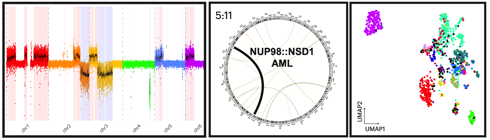

<!-- badges: start -->
[](https://cran.r-project.org/web/packages/pacbiowdlR)
[](https://cran.rstudio.com/package=pacbiowdlR)
[](https://codecov.io/gh/yourusername/pacbiowdlR)
<!-- badges: end -->

<br>

<div style="text-align:left">
  <span>
    <a href="https://github.com/scfurl/pacbiowdlR">
      
    </a>
  </span>
</div>

<br>

<a href="man/figures/splash.png">
  
</a>

**pacbiowdlR** is an R package that offers a suite of functions for visualizing and downstream processing of output from the PacBio WGS WDL workflows.

The package is designed to work seamlessly with output files from the pacbiowdlR pipeline (e.g., BigWig depth files and VCF variant call files). Its interactive and customizable plots support both quick diagnostic visualizations and in-depth exploratory data analysis.

Currently, we have copy number alteration plots, gene fusion diagrams, and functions to process CpG calls and HLA type

---

## Getting Started


Or install the development version from **GitHub**:

```r
if (!require("devtools")) install.packages("devtools")
devtools::install_github("scfurl/pacbiowdlR")
```

Once installed, you can load the package and create a CNA plot using a single function call:

```r
library(pacbiowdlR)

# Example file paths (replace with your own)
depth_file <- system.file("extdata", "examples/K562.GRCh38.hificnv.depth.bw", package = "pacbiowdlR")
cna_calls <- system.file("extdata", "examples/K562.GRCh38.hificnv.vcf.gz", package = "pacbiowdlR")

# Create a CNA plot using the 'fit' method
CNAPlot(
  depth_bigwig_file  = depth_file,
  variant_file       = cna_calls,
  method             = "fit",
)
```

---

## Examples

For more examples of how to use **pacbiowdlR**, please refer to the package [vignettes](https://scfurl/pacbiowdlR/articles/) and the [reference documentation](https://scfurl/pacbiowdlR/reference/). Here are a few quick examples:

For more detailed examples, check out the package vignettes online.

---

Enjoy your analysis and please report any issues or suggestions on the [GitHub issues page](https://github.com/scfurl/pacbiowdlR/issues)! 

Happy plotting!
