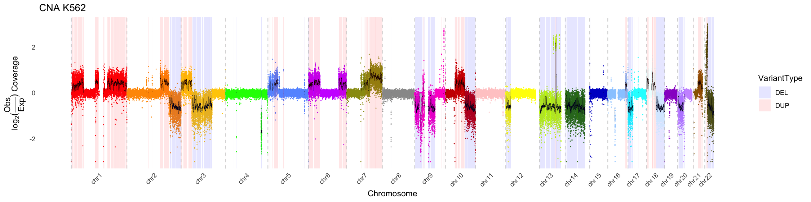

Below is an example of an **index.md** file for your pkgdown site. You can customize the badges, image links, and text as needed. Save this file in the root of your package (usually in the "docs" folder or next to your pkgdown configuration) so that pkgdown uses it as the home page.

```markdown
<!-- badges: start -->
[](https://cran.r-project.org/web/packages/pacbiowdlR)
[](https://cran.rstudio.com/package=pacbiowdlR)
[](https://github.com/yourusername/pacbiowdlR/actions)
[](https://codecov.io/gh/yourusername/pacbiowdlR)
<!-- badges: end -->

<br>

<div style="text-align:left">
  <span>
    <a href="https://github.com/yourusername/pacbiowdlR">
      
    </a>
    <h2><strong>pacbiowdlR</strong></h2>
    <h4>Plotting Copy Number Alterations from PacBio WDL Data</h4>
  </span>
</div>

<br>

<a href="man/figures/CNAPlot_fit.png">
  
</a>
<a href="man/figures/CNAPlot_delta.png">
  
</a>
<a href="man/figures/CNAPlot_loess.png">
  
</a>
<a href="man/figures/CNAPlot_geneHighlight.png">
  
</a>

**pacbiowdlR** is an R package that offers a suite of functions for visualizing DNA copy number alterations (CNAs) from PacBio workflows. The plots, built with **ggplot2**, include options to calculate delta values using different methods (simple difference, LOESS log-ratio, or linear model–based log-ratio) and to annotate CNAs with gene information and cytogenetic features.

The package is designed to work seamlessly with output files from the pacbiowdlR pipeline (e.g., BigWig depth files and VCF variant call files). Its interactive and customizable plots support both quick diagnostic visualizations and in-depth exploratory data analysis.

---

## Getting Started

Install the latest release from **CRAN**:

```r
install.packages("pacbiowdlR")
```

Or install the development version from **GitHub**:

```r
if (!require("devtools")) install.packages("devtools")
devtools::install_github("yourusername/pacbiowdlR")
```

Once installed, you can load the package and create a CNA plot using a single function call:

```r
library(pacbiowdlR)

# Example file paths (replace with your own)
depth_file <- system.file("extdata", "examples/K562.GRCh38.hificnv.depth.bw", package = "pacbiowdlR")
cna_calls <- system.file("extdata", "examples/K562.GRCh38.hificnv.vcf.gz", package = "pacbiowdlR")

# Create a CNA plot using the 'fit' method
CNAPlot(
  depth_bigwig_file  = depth_file,
  variant_file       = cna_calls,
  txdb               = TxDb.Hsapiens.UCSC.hg38.knownGene,
  method             = "fit",
  downsample         = 0.1,
  samplename         = "K562",
  max_value          = 3.5,
  min_value          = -3.5
)
```

---

## Examples

For more examples of how to use **pacbiowdlR**, please refer to the package [vignettes](https://yourusername.github.io/pacbiowdlR/articles/) and the [reference documentation](https://yourusername.github.io/pacbiowdlR/reference/). Here are a few quick examples:

```r
# Using the 'delta' method
CNAPlot(
  depth_bigwig_file  = depth_file,
  variant_file       = cna_calls,
  txdb               = TxDb.Hsapiens.UCSC.hg38.knownGene,
  method             = "delta",
  samplename         = "K562"
)

# Custom colors and line styling
chrom_palette <- c(
  "#FF0000", "#FF9900", "#FFCC00", "#00FF00", "#6699FF", "#CC33FF",
  "#999912", "#999999", "#FF00CC", "#CC0000", "#FFCCCC", "#FFFF00",
  "#CCFF00", "#358000", "#0000CC", "#99CCFF", "#00FFFF", "#ECFFFF",
  "#9900CC", "#CC99FF", "#996600", "#666600", "#666666", "#CCCCCC",
  "#79CC3B", "#E0EC3B", "#CCC99F"
)

CNAPlot(
  depth_bigwig_file  = depth_file,
  variant_file       = cna_calls,
  txdb               = TxDb.Hsapiens.UCSC.hg38.knownGene,
  method             = "fit",
  line_color         = "black",
  samplename         = "K562",
  max_value          = 3.5,
  min_value          = -3.5,
  colors             = chrom_palette
)
```

For more detailed examples, check out the package vignettes online.

---

Enjoy your analysis and please report any issues or suggestions on the [GitHub issues page](https://github.com/yourusername/pacbiowdlR/issues)! 

Happy plotting!
```

