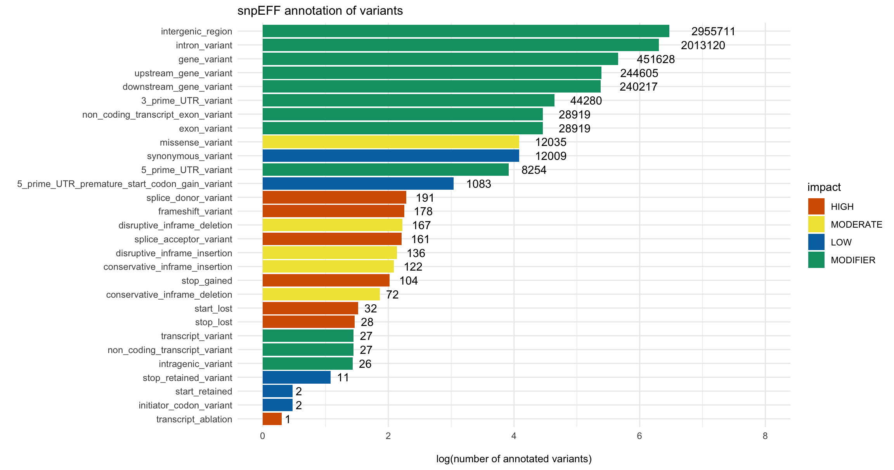

```{r, child="children/SETTINGS-knitr_long.txt"}
```

## Plotting SnpEff Variants

Plotting the number of variants by annotation category.  One needs to first annotate carients using SnpEff.  This may take a while.

```{r, eval=FALSE}
library(pacbiowdlR)
variantsfile <- "location/small_variants.ann.txt.gz"
plot_snpEff(variantsfile, cores = 16)
```

{width=100%}
